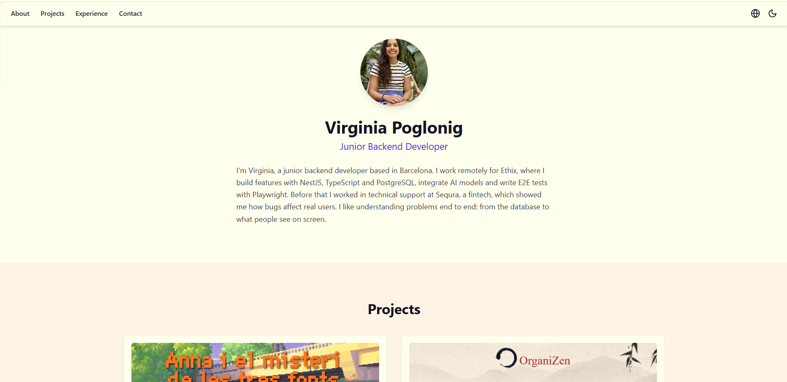

# 🌟 Mi Portfolio Personal | React + Vite



Este repositorio contiene el código fuente de mi portfolio personal, una aplicación web desarrollada utilizando **React** y **Vite**.

El objetivo de este proyecto es presentar mis habilidades, experiencia y proyectos personales de desarrollo web.

---

## 🚀 Ver el Portfolio Desplegado

El portfolio está desplegado y accesible públicamente a través de GitHub Pages:

**[Visitar Portfolio](https://vpogf.github.io/mi-portfolio/)**

---

## 🛠️ Tecnologías Utilizadas

*   **React**: Biblioteca de JavaScript para construir interfaces de usuario..
*   **Vite:** Herramienta de construcción rápida para el entorno de desarrollo.
*   **Tailwind CSS:** Framework de CSS utility-first para un diseño responsive y moderno.
*   **JavaScript (ES6+):** Lenguaje de programación principal.
*   **HTML5 & CSS3:** Estructura y estilos básicos.
*   **Git & GitHub Pages:** Control de versiones y despliegue.

---

## ⚙️ Configuración del Proyecto (Para Desarrolladores)

Si deseas clonar este proyecto y ejecutarlo localmente para desarrollo o revisión, sigue estos pasos:

### Prerrequisitos

Asegúrate de tener **Node.js** y **npm** instalados en tu sistema.

### Instalación

1.  **Clona el repositorio:**
    ```bash
    git clone https://github.com/VpogF/mi-portfolio.git
    ```

2.  **Navega al directorio del proyecto:**
    ```bash
    cd mi-portfolio
    ```

3.  **Instala las dependencias:**
    ```bash
    npm install
    ```

### Ejecución

1.  **Inicia el servidor de desarrollo local:**
    ```bash
    npm run dev
    ```

2.  Abre tu navegador web y visita la dirección que aparece en la consola (normalmente `http://localhost:5173`).

---

## ✨ Características Principales

*   Diseño responsive y moderno.
*   Uso de componentes de React para una interfaz modular.
*   Despliegue automatizado con GitHub Pages.

---

## 📫 Contacto

Si tienes preguntas o quieres saber más sobre mi trabajo, no dudes en contactarme a través de mi [perfil de LinkedIn](https://www.linkedin.com/in/vpoglonig/).

